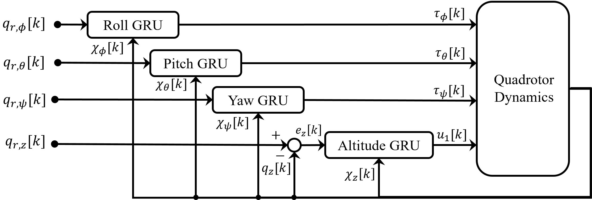
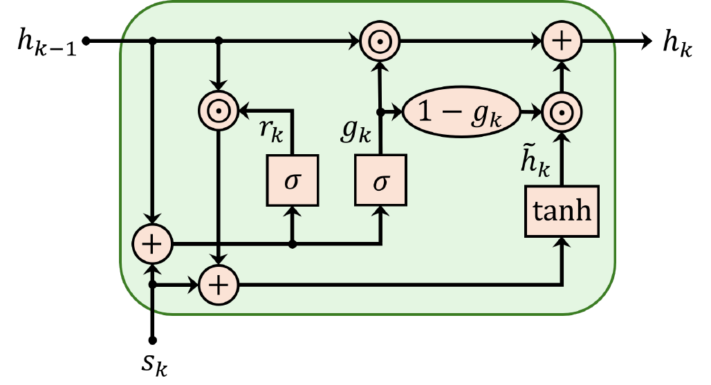
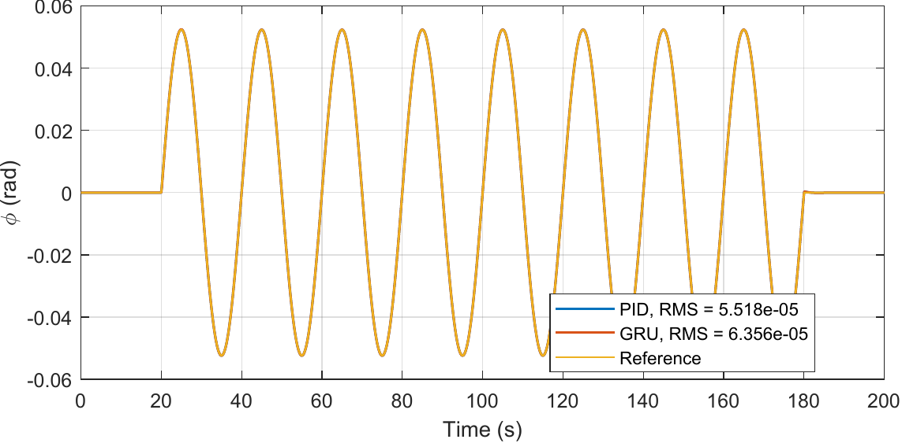
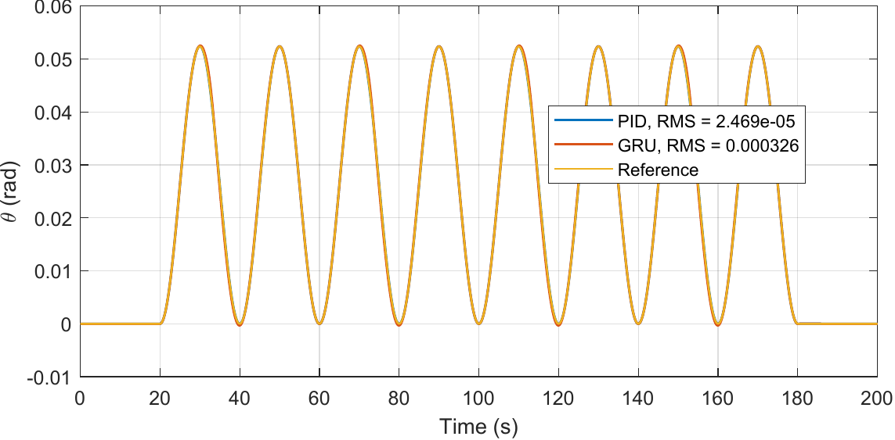
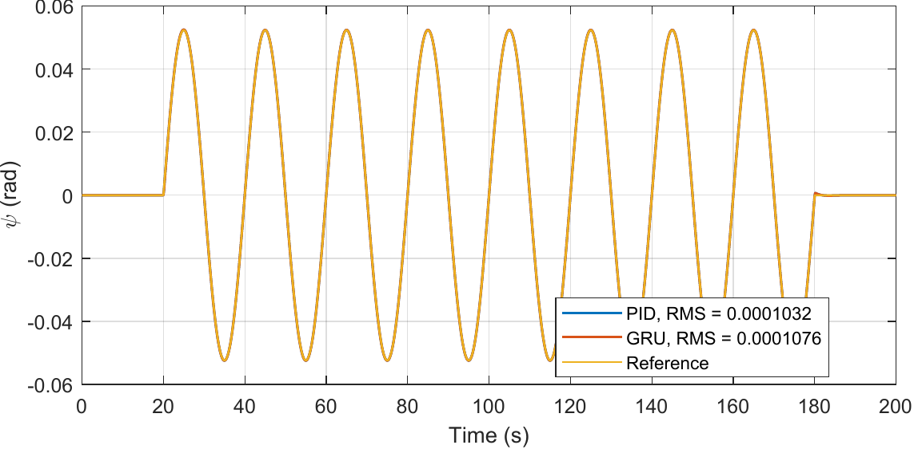
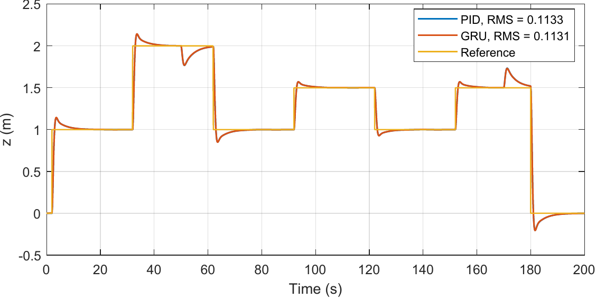

# UAV Modeling, Identification, and Neural Controller Imitation

This repository contains neural-network-based modeling, identification, and controller-imitation experiments for quadcopters. The sequence starts with MLP-based plant identification and progresses through RNN, LSTM, and GRU models for imitating PID controllers in nonlinear quadrotor simulations.

The code is published for reference and reuse. For collaboration or questions about continuing this work, open an issue or contact [IshaqHMK](https://github.com/IshaqHMK).

The unpublished paper draft, TeX source, trained checkpoints, large generated datasets, local environments, and bulk run outputs are not included.

## Where This Work Stopped

The organized code history reaches `C68`. The final stage studied GRU imitation of PID loops for altitude, roll, pitch, and yaw in a nonlinear quadrotor simulation with attitude coupling and vertical wind disturbance.

This direction was stopped because the GRU controllers were not a practical replacement for PID. They learned PID-like behavior under selected simulation conditions, but did not provide the reliability, speed, generalization, or stability guarantees needed for real UAV control.

This work should be treated as a simulation-based controller-imitation study, not as a deployable UAV controller.

## Final Method Summary

The final experiments used a simplified nonlinear quadrotor model with altitude coupled to roll and pitch through the vertical projection of thrust. The state and control vectors were:

$$
x(t)=
\begin{bmatrix}
z(t) & \dot z(t) & \phi(t) & \dot\phi(t) & \theta(t) & \dot\theta(t) & \psi(t) & \dot\psi(t)
\end{bmatrix}^{T}
$$

$$
u(t)=
\begin{bmatrix}
u_1(t) & \tau_\phi(t) & \tau_\theta(t) & \tau_\psi(t)
\end{bmatrix}^{T}
$$

where `z` is altitude, `phi`, `theta`, and `psi` are roll, pitch, and yaw, `u1` is total thrust, and `tau_phi`, `tau_theta`, and `tau_psi` are body-axis control torques.

The altitude dynamics were modeled as:

$$
m\ddot z(t)=u_1(t)\cos\phi(t)\cos\theta(t)-K_{dz}\dot z(t)+F_{wz}(t)-mg
$$

The attitude dynamics used:

$$
I_x\ddot\phi(t)=(I_y-I_z)\dot\theta(t)\dot\psi(t)+\tau_\phi(t)
$$

$$
I_y\ddot\theta(t)=(I_z-I_x)\dot\phi(t)\dot\psi(t)+\tau_\theta(t)
$$

$$
I_z\ddot\psi(t)=(I_x-I_y)\dot\phi(t)\dot\theta(t)+\tau_\psi(t)
$$

The baseline controller was PID. For each channel `j` in `{z, phi, theta, psi}`, the tracking error, integral term, and derivative estimate were:

$$
e_j[k]=q_{r,j}[k]-q_j[k]
$$

$$
\eta_j[k+1]=\eta_j[k]+T_s e_j[k]
$$

$$
d_j[k]=
\begin{cases}
0, & k=0 \\
\dfrac{e_j[k]-e_j[k-1]}{T_s}, & k\ge 1
\end{cases}
$$

The altitude PID command included gravity compensation:

$$
u_1[k]=mg+K_{P,z}e_z[k]+K_{I,z}\eta_z[k]+K_{D,z}d_z[k]
$$

The attitude PID commands were:

$$
\tau_i[k]=K_{P,i}e_i[k]+K_{I,i}\eta_i[k]+K_{D,i}d_i[k],
\qquad i\in\{\phi,\theta,\psi\}
$$

## GRU Controller Form

The GRU models were trained as sequence-to-one regressors. At each sample, the input for channel `j` was:

$$
\chi_j[k]=
\begin{bmatrix}
q_j[k] & e_j[k] & d_j[k] & \eta_j[k]
\end{bmatrix}^{T}
$$

with a window of length `L`:

$$
\mathcal{S}_j[k]=
\left(
\chi_j[k-L+1],\chi_j[k-L+2],\ldots,\chi_j[k]
\right)
$$

The altitude GRU predicted thrust:

$$
\hat u_1[k]=\mathcal{G}_z(\mathcal{S}_z[k])
$$

The attitude GRUs predicted torques:

$$
\hat \tau_i[k]=\mathcal{G}_i(\mathcal{S}_i[k]),
\qquad i\in\{\phi,\theta,\psi\}
$$

Two final controller ideas were tested:

- Single-channel replacement: one PID loop was replaced by its GRU while the other loops stayed PID.
- Combined replacement: four separately trained GRUs generated `u1`, `tau_phi`, `tau_theta`, and `tau_psi` at the same time.

## Final Figures

The figures below come from the final-stage experiments.

<p align="center">
  
  <br>
  <em>Implemented GRU control structure.</em>
</p>

<p align="center">
  
  <br>
  <em>Single GRU cell and hidden-state update.</em>
</p>

<p align="center">
  
  <br>
  <em>Altitude response: PID compared with single-channel altitude GRU.</em>
</p>

<p align="center">
  
  <br>
  <em>Roll response: PID compared with single-channel roll GRU.</em>
</p>

<p align="center">
  
  <br>
  <em>Pitch response: PID compared with single-channel pitch GRU.</em>
</p>

<p align="center">
  
  <br>
  <em>Yaw response: PID compared with single-channel yaw GRU.</em>
</p>

<p align="center">
  
  <br>
  <em>Combined four-GRU test: altitude response compared with full PID.</em>
</p>

Additional figures are in [docs/figures](docs/figures/). The editable PowerPoint source for block diagrams is in [docs/figure_sources](docs/figure_sources/).

## RNN/GRU Control Limitations

The GRUs learned PID-like input-output behavior in supervised training. The limitation was closed-loop control: imitating PID commands did not provide the same engineering guarantees as the original PID controller.

- No closed-loop stability proof was established for the learned GRU controllers.
- Small prediction errors can accumulate in closed loop, especially when all four channels are replaced at the same time.
- The learned controller is distribution-dependent; performance is tied to the reference signals, disturbance levels, gains, sampling time, and operating region used during training.
- GRU inference and sequence handling add runtime overhead compared with simple PID arithmetic, which matters for embedded UAV control loops.
- Training a controller to imitate PID does not automatically improve robustness, actuator safety, or stability margins.
- Simulation success does not imply flight readiness without hardware timing tests, sensor noise tests, actuator saturation handling, and formal safety analysis.

For this reason, the direct PID-replacement path was not continued. More suitable uses of neural networks may be model identification, disturbance estimation, adaptive gain tuning, or residual compensation around a conventional stabilizing controller.

## Repository Structure

```text
.
|-- README.md
|-- docs/
|   |-- figures/           # selected final figures for GitHub display
|   `-- figure_sources/    # editable block diagram source files
|-- python/
|   |-- C1/
|   |-- C2/
|   |-- ...
|   `-- C68/
`-- notes/                 # local development/HPC notes from the project
```

Each `python/Cxx` folder is a milestone. Later folders often contain both training scripts and test-only scripts. Some scripts expect generated `.mat` files or trained checkpoints that are not committed.

## Development Phases

| Phase | Folders | Description |
|---|---:|---|
| Early direct models | `C1` to `C15` | MLP direct/inverse modeling, replay checks, PID-on-learned-plant tests, PSO initialization. |
| RNN and GRU PID imitation | `C16` to `C25` | TensorFlow/PyTorch recurrent PID-imitation experiments, LSTM/GRU variants, shared and per-axis studies. |
| GRU replay and checkpoint studies | `C28` to `C41` | Multi-dataset GRU training, dynamics replay, plotting companions, checkpoint reuse, GPU-ready scripts. |
| Simulated Z-axis studies | `C42` to `C53` | Fixed-step simulation data, linear altitude PID, wind disturbance sweeps, PRBS/APRBS reference tests. |
| Nonlinear quadrotor studies | `C54` to `C59` | Nonlinear altitude dynamics, roll/pitch coupling, yaw channel, estimator features, shared multiaxis GRU. |
| Final GRU replacement studies | `C60` to `C68` | Single-axis GRUs, four separate GRUs in one loop, and one joint all-axis GRU model. |

## Milestone Index

- [C1](python/C1/) first experimental direct-model MLP on flight logs.
- [C2](python/C2/) replay/validation of the C1 direct model on the same log.
- [C3](python/C3/) early PID-on-learned-plant closed-loop test.
- [C4](python/C4/) direct model extended to angles and rates.
- [C5](python/C5/) refined angles/rates direct model used by later tests.
- [C6](python/C6/) full-sequence evaluation of the C5 direct model.
- [C7](python/C7/) lightweight C5 replay script.
- [C8](python/C8/) cascaded attitude PID on the learned C5 plant.
- [C9](python/C9/) outer-loop attitude PID on the learned C5 plant.
- [C10](python/C10/) radian-unit direct model with corrected alignment variant.
- [C11](python/C11/) outer-loop PID using the radian-unit C10 model.
- [C12](python/C12/) lightweight evaluation of the C10 model.
- [C13](python/C13/) inverse model predicting controls from state transitions.
- [C14](python/C14/) PSO-initialized direct model with manual PSO.
- [C15](python/C15/) PSO-initialized direct model with PySwarms.
- [C16](python/C16/) TensorFlow error-to-control RNN prototype.
- [C17](python/C17/) LSTM sequence direct model.
- [C18](python/C18/) minimal LSTM direct-model baseline.
- [C19](python/C19/) cleaned/explained RNN direct-model variants.
- [C20](python/C20/) PID-imitation RNN variants.
- [C21](python/C21/) diagnostics and variable-step PID features.
- [C22](python/C22/) multi-dataset sequential training and sequence-length sweep.
- [C23](python/C23/) shared multi-dataset PID RNN.
- [C24](python/C24/) shared multi-dataset PID GRU.
- [C25](python/C25/) shared multi-dataset vanilla RNN baseline.
- [C26](python/C26/) archived result figures.
- [C27](python/C27/) archived result figures.
- [C28](python/C28/) shared GRU retraining on a new dataset family.
- [C29](python/C29/) C28 plotting companion and full dynamics replay.
- [C30](python/C30/) GRU-in-the-loop dynamics replay.
- [C31](python/C31/) shared GRU retraining checkpoint family.
- [C32](python/C32/) PID dynamics replay baseline.
- [C33](python/C33/) plotting companion for the C31 GRU.
- [C34](python/C34/) GRU-in-the-loop replay aligned with C31.
- [C35](python/C35/) shared GRU retraining variant.
- [C36](python/C36/) plotting companion for C35.
- [C37](python/C37/) GRU-in-the-loop replay using C35.
- [C38](python/C38/) plotting companion for long GPU runs.
- [C39](python/C39/) plotting companion for another GPU run family.
- [C40](python/C40/) GRU-in-the-loop replay with alternate checkpoint.
- [C41](python/C41/) GPU-ready GRU-in-the-loop dynamics replay.
- [C42](python/C42/) fixed-step simulated dataset generation and replay utilities.
- [C43](python/C43/) shared GRU training on simulated datasets.
- [C44](python/C44/) plotting companion for C43.
- [C45](python/C45/) baseline linear Z-axis PID and GRU imitation.
- [C46](python/C46/) refined linear Z experiment and model reuse tests.
- [C47](python/C47/) wind-disturbance sweep with/without measured feedback.
- [C48](python/C48/) reference-amplitude and wind-level generalization grid.
- [C49](python/C49/) PRBS wind disturbance tests.
- [C50](python/C50/) APRBS reference generator.
- [C51](python/C51/) APRBS-style references in the linear Z pipeline.
- [C52](python/C52/) disturbance-only variation with one reference setting.
- [C53](python/C53/) C52-style setup for longer HPC/AWS runs.
- [C54](python/C54/) nonlinear Z dynamics with roll/pitch coupling.
- [C55](python/C55/) yaw control and multi-seed wind-sweep training.
- [C56](python/C56/) direct-model/state-estimator study for Z dynamics.
- [C57](python/C57/) indirect GRU controller using estimator features.
- [C58](python/C58/) adaptive closed-loop correction demo.
- [C59](python/C59/) shared GRU for z/roll/pitch/yaw with 16 inputs and 4 outputs.
- [C60](python/C60/) nonlinear Z-axis PID data and single altitude GRU.
- [C61](python/C61/) joint nonlinear four-axis GRU baseline.
- [C62](python/C62/) stabilized Z-axis GRU branch.
- [C63](python/C63/) four separate GRUs trained and applied together.
- [C64](python/C64/) roll-axis GRU replacement test.
- [C65](python/C65/) pitch-axis GRU replacement test.
- [C66](python/C66/) yaw-axis GRU replacement test.
- [C67](python/C67/) all-axes closed-loop test using separate trained GRUs.
- [C68](python/C68/) joint all-axes GRU controller.

## Requirements

The scripts were developed across multiple stages, so exact requirements vary by folder. The common Python stack is:

```text
Python 3.10+
numpy
matplotlib
torch
scikit-learn
scipy
```

Some later plotting workflows used MATLAB for `.mat` result files.

## Notes For Reuse

This is research code. Many scripts are self-contained iterations, and some later scripts expect generated files that were too large to publish. A useful reading path is:

1. Read the final method sections above.
2. Inspect `C62`, `C64`, `C65`, `C66`, `C67`, and `C68` for the final GRU controller experiments.
3. Work backward through `C54` to `C61` to understand how the nonlinear simulation and controller imitation pipeline developed.
4. Use the early `C1` to `C25` folders as historical context for the modeling and recurrent-network trials.
